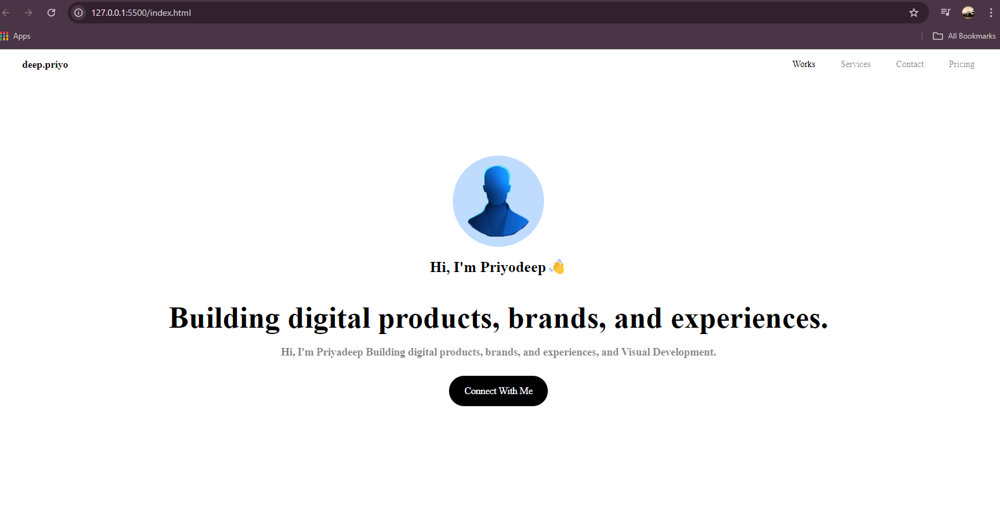
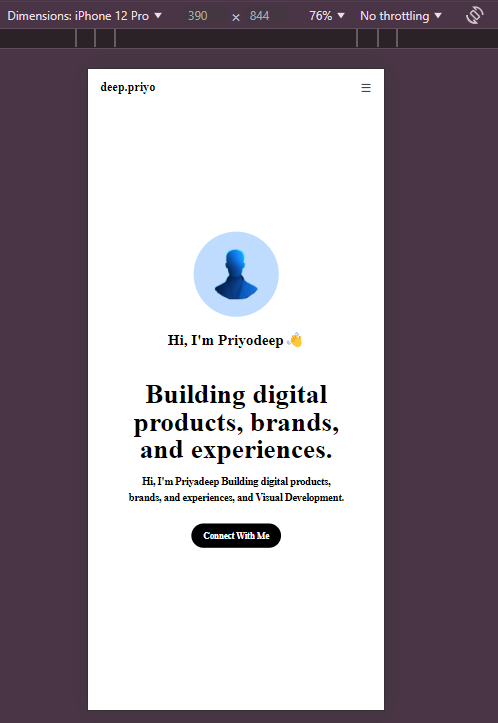

# Tailwind CSS Portfolio Page

This is a **responsive portfolio webpage** created using **Tailwind CSS**. Through this project, I learned how to build modern, minimalistic web designs, focusing on responsive layouts and utility-based CSS classes provided by Tailwind. The page is fully responsive and adapts to different screen sizes, including mobile, tablet, and desktop.

## Features
- Responsive design with **Tailwind CSS**.
- Clean, minimalistic layout for a personal portfolio.
- Mobile-first design with an intuitive navigation menu.
- Interactive sections that highlight personal branding, services, and more.

## Technologies Used
- **HTML5**: For creating the structure of the webpage.
- **Tailwind CSS**: For styling and making the page fully responsive.
- **Remix Icon**: For the menu icon and other small icons.

## Screenshots

### Desktop View


### Mobile View


## How to Use

1. Clone the repository:
   ```bash
   git clone https://github.com/deep-priyo/tailwindcss-portfolio.git
